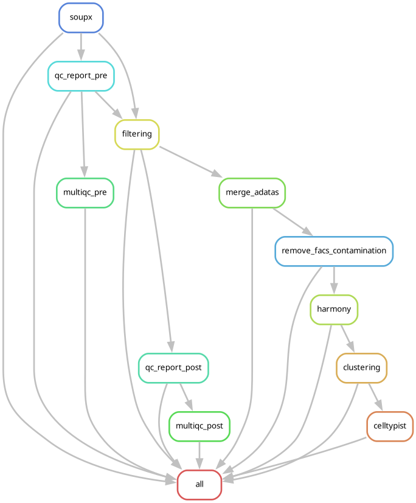

# scRNA-seq Processing Pipeline

Snakemake workflow to process scRNA-seq count matrices from QC to automated cell type annotation. Covers ambient RNA correction, quality control, filtering, integration, clustering, and annotation.



---

## Pipeline steps

### Step 1 — Ambient RNA correction (SoupX)
Corrects ambient RNA contamination in raw count matrices using SoupX. Runs per sample on the filtered and raw feature-barcode matrices. Optionally applied only to specific FACS fractions. Outputs a corrected `.h5ad` per sample. Can be skipped by setting `soupx.use_soupx: false`.

### Step 2 — Pre-filtering QC
Generates a per-sample QC report (HTML + PDF) and a cell-level metrics CSV before any filtering. Computes standard QC metrics (number of genes, counts, mitochondrial fraction) and flags outlier cells using MAD-based and/or hard thresholds. The outlier flags from this step are consumed directly by the filtering step.

### Step 3 — Cohort pre-filtering QC summary
Aggregates the per-sample pre-filtering metrics into a single cohort-level report (HTML + PDF + CSV). Produces comparative plots across all samples, colored by user-defined metadata columns.

### Step 4 — Cohort post-filtering QC summary
Same as Step 3 but using the post-filtering metrics, allowing direct comparison of the cohort before and after filtering.

### Step 5 — Filtering
Filters each sample using the outlier flags computed in Step 2 — no MAD recomputation. Optionally removes doublets (detected by Scrublet), mitochondrial genes, ribosomal genes, and MALAT1.

### Step 6 — Post-filtering QC
Generates a per-sample QC report after filtering to confirm the cell population retained.

### Step 7 — Merge
Concatenates all per-sample filtered `.h5ad` objects into a single cohort-level object. Genes are merged by union or intersection depending on `merge.join`.

### Step 8 — FACS contamination removal
Identifies and removes cross-fraction FACS contamination from the merged object. Detects cells from sorted fractions that ended up in the wrong fraction using a preliminary clustering. Specific leiden clusters can also be removed manually via `remove_clusters`.

### Step 9 — Harmony integration
Integrates samples using Harmony to correct for batch effects. Runs PCA, computes a Harmony-corrected embedding, and builds a UMAP. Outputs an integrated `.h5ad` and a PDF of integration plots. Can be skipped by setting `harmony.run_harmony: false`.

### Step 10 — Clustering
Runs Leiden clustering at multiple resolutions on the integrated (or merged) object. Scores marker gene signatures and produces a UMAP for each resolution. Outputs an annotated `.h5ad` with all clustering results.

### Step 11 — CellTypist annotation
Annotates cells automatically using CellTypist majority voting. Uses a species-appropriate default model if none is specified. Produces a `.h5ad` with predicted cell type labels and UMAP figures.

---

## Requirements

- [Snakemake](https://snakemake.readthedocs.io) ≥ 7
- [Conda](https://docs.conda.io) / [Mamba](https://mamba.readthedocs.io)

---

## Usage

```bash
# With conda environments only (Mac or Linux without Apptainer)
snakemake --use-conda --cores N
```

---

## Input files

| File | Description |
|---|---|
| `config/config.yaml` | Pipeline parameters (see below) |
| `config/samples.csv` | Sample sheet with columns: `sample_id`, `path`, and QC thresholds (use example `samples.csv` file) |
| `config/soupgenes.txt` | List of genes used as soup markers for SoupX |
| `config/markers.csv` | Marker gene table with columns: `gene`, `cell_state` |

---

## Configuration reference

All parameters are set in `config/config.yaml`.

### `species`
Species of the samples. Used to select the default CellTypist model.  
Values: `"human"` | `"mouse"`

---

### `input`
| Parameter | Description |
|---|---|
| `samples` | Path to the sample sheet CSV |

---

### `output`
Output directories for each step. Defaults point to `results/`. Change these to redirect outputs to a different location.

---

### `qc_plots`
| Parameter | Description |
|---|---|
| `color_by` | List of metadata columns to use for coloring cohort QC plots (e.g. `fraction`, `sex`, `response_type`) |

---

### `doublets`
| Parameter | Default | Description |
|---|---|---|
| `run_scrublet` | `true` | Run Scrublet doublet detection |
| `expected_rate` | `0.05` | Expected doublet rate passed to Scrublet |
| `remove_doublets` | `true` | If `true`, predicted doublets are removed during filtering |

---

### `filter_genes`
| Parameter | Default | Description |
|---|---|---|
| `remove_mt` | `true` | Remove mitochondrial genes from the count matrix |
| `remove_ribo` | `true` | Remove ribosomal genes from the count matrix |
| `remove_malat1` | `true` | Remove MALAT1 from the count matrix |

---

### `merge`
| Parameter | Default | Description |
|---|---|---|
| `join` | `"union"` | How to merge gene sets across samples: `"union"` keeps all genes (missing filled with 0), `"intersection"` keeps only shared genes |

---

### `soupx`
| Parameter | Default | Description |
|---|---|---|
| `use_soupx` | `true` | If `true`, QC and filtering use SoupX-corrected counts. If `false`, original count matrices are used |
| `soupgenes` | `config/soupgenes.txt` | Path to file listing soup marker genes |
| `apply_to_fractions` | `["IMMUNE"]` | FACS fraction labels to apply SoupX correction to |

---

### `pp` (preprocessing)
| Parameter | Default | Description |
|---|---|---|
| `scale` | `false` | Whether to scale gene expression |
| `normalize` | `total_counts` | Normalization method |
| `factor` | `10000` | Target sum for normalization (e.g. counts per 10k) |

---

### `harmony`
| Parameter | Default | Description |
|---|---|---|
| `run_harmony` | `true` | If `true`, runs Harmony integration (Step 9). If `false`, clustering uses the merged object directly |
| `integration_keys` | `[sample_id]` | Metadata columns to correct for (e.g. `sample_id`, `batch`) |
| `n_pcs` | `20` | Number of PCs to use for Harmony integration |
| `thetas` | `null` | Diversity clustering penalty per key. `null` uses the Harmony default |

---

### `clustering`
| Parameter | Default | Description |
|---|---|---|
| `use_harmony` | `true` | If `true`, clustering uses the Harmony-integrated UMAP. Must match `harmony.run_harmony` |
| `resolution_test` | `[0.1 … 1.0]` | List of Leiden resolutions to test |
| `seed` | `42` | Random seed for reproducibility |
| `marker_file` | `config/markers.csv` | CSV with marker genes for cell state scoring |

---

### FACS contamination removal
| Parameter | Default | Description |
|---|---|---|
| `non_sorted_flag` | `"Non-sorted"` | Label identifying non-sorted cells in the fraction metadata |
| `immune_label` | `"IMMUNE"` | Label for the immune fraction |
| `epidn_label` | `"EPI+DN"` | Label for the epithelial/double-negative fraction |
| `remove_clusters` | `[]` | List of Leiden cluster IDs to forcibly remove (e.g. `[3, 7]`). Empty list removes nothing |

---

### `celltypist`
| Parameter | Default | Description |
|---|---|---|
| `model` | `null` | CellTypist model name. If `null`, uses species default: `Adult_Mouse_Gut` (mouse) or `Cells_Intestinal_Tract` (human) |
| `leiden_key` | `null` | Leiden resolution key to use for majority-voting crosstab. If `null`, uses the first available |
